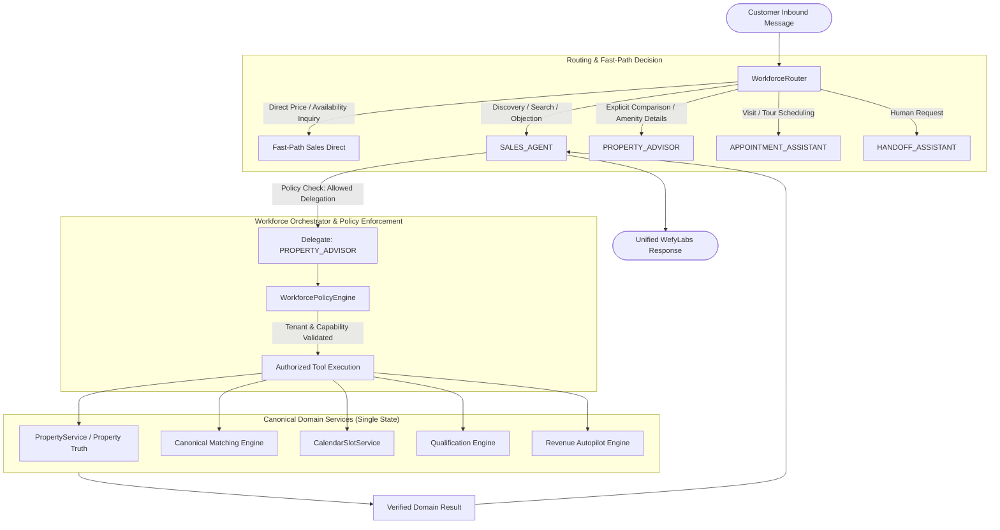

# WEFYLABS AI WORKFORCE — AGENT FLOW MAP

## 1. Unified Customer Interaction Flow



---

## 2. Delegation Pattern: Sales Agent -> Property Advisor

```text
CUSTOMER: "Can you compare the second property with one that has covered parking?"
│
├── 1. WorkforceRouter: Evaluates intent -> Identifies complex comparison requirement.
│      Selected Agent: SALES_AGENT (depth=0)
│
├── 2. SALES_AGENT: Prepares structured delegation request.
│      Target: PROPERTY_ADVISOR
│      Objective: "Compare Property A and Property B regarding parking and pricing"
│      Context: Bounded property IDs, buyer budget ceiling (1.5 Cr)
│
├── 3. WorkforcePolicyEngine:
│      ✔ Validates delegation permission: SALES_AGENT -> PROPERTY_ADVISOR (ALLOWED)
│      ✔ Checks current depth: 1 <= MAX_AGENT_DEPTH (3)
│      ✔ Cycle detection: [SALES_AGENT] does not contain PROPERTY_ADVISOR
│      ✔ Validates tenant boundary: organization_id matches session
│
├── 4. PROPERTY_ADVISOR: Executes authorized tool `compare_properties`.
│      ✔ Accesses canonical PropertyService (never an independent database)
│      ✔ Returns verified facts: Unit A has 1 covered space; Unit B has 2 open bays
│
├── 5. PROPERTY_ADVISOR -> SALES_AGENT:
│      Returns structured AgentResultDTO (status=SUCCESS, data={...})
│
└── 6. SALES_AGENT: Synthesizes friendly, unified customer answer.
       No internal agent names or delegation mechanics leaked to customer.
```

---

## 3. Delegation Pattern: Sales Agent -> Appointment Assistant (Confirmation Gated)

```text
CUSTOMER: "I'd like to tour Veritas Luxury Heights this Saturday at 3 PM."
│
├── 1. WorkforceRouter: Evaluates intent -> APPOINTMENT_ASSISTANT (depth=0)
│
├── 2. APPOINTMENT_ASSISTANT: Executes `get_available_slots`.
│      ✔ Queries CalendarSlotService for verified broker availability.
│      ✔ Finds available slot: Saturday 2026-09-26 15:00:00 UTC.
│
├── 3. Confirmation Policy Check:
│      Action: `book_viewing`
│      Policy: Side-effecting CRM mutation requires explicit confirmation.
│      Result: CONFIRMATION_REQUIRED
│
├── 4. APPOINTMENT_ASSISTANT -> Orchestrator -> Customer:
│      "I found an opening on Saturday at 3:00 PM for Veritas Luxury Heights. Would you like me to reserve this viewing for you?"
│      (Structured confirmation metadata attached to turn)
│
├── 5. CUSTOMER: "Yes, please confirm it."
│      Incoming context carries: confirmed_action=True
│
├── 6. APPOINTMENT_ASSISTANT: Executes `book_viewing` via verified CalendarSlotService.
│      ✔ Generates authoritative viewing appointment in PostgreSQL database.
│      ✔ Emits ActionReceiptDTO(receipt_id="...", action_type="book_viewing", status="confirmed")
│
└── 7. Customer receives authoritative confirmation receipt.
```

---

## 4. Internal Operational Flow: Manager Command Agent -> Revenue Autopilot

```text
MANAGER: "Which high-value leads are stalled and need attention today?"
│
├── 1. WorkforceRouter:
│      Caller Role: "manager"
│      Selected Agent: MANAGER_COMMAND_AGENT
│
├── 2. MANAGER_COMMAND_AGENT:
│      ✔ Validates caller role: MANAGER_COMMAND_AGENT is accessible to managers/brokers.
│      ✔ Executes tool `get_stalled_opportunities` + `get_pipeline_metrics`.
│
├── 3. Canonical Services:
│      ✔ Reads Revenue Autopilot pipeline states.
│      ✔ Evaluates SLA breaches (response time > 4 hours).
│      ✔ Identifies 3 deals with high engagement score but inactive status.
│
└── 4. MANAGER_COMMAND_AGENT: Returns structured diagnostic table with prioritized next actions.
```
