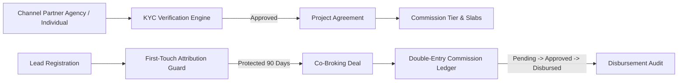
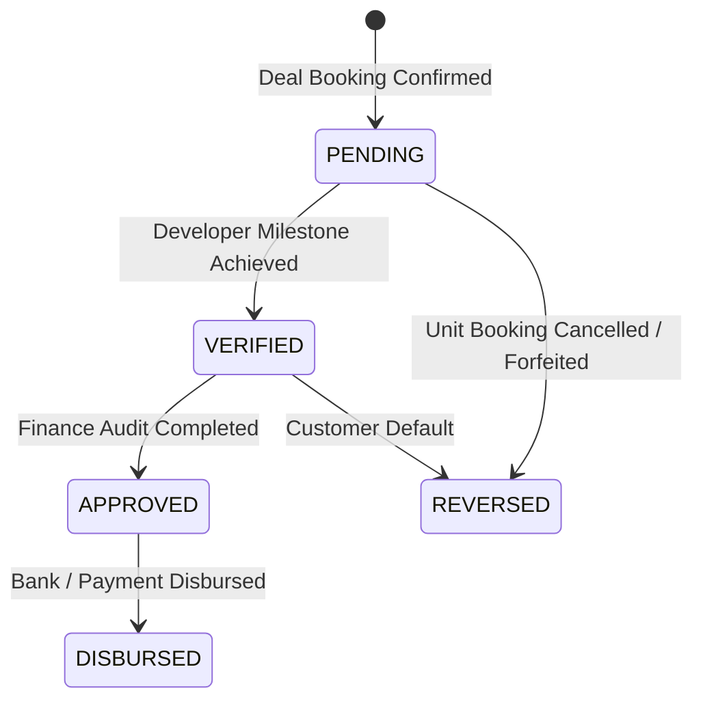

# WEFYLABS CHANNEL PARTNER (CP) OS: ARCHITECTURE & NETWORK MODEL
## Institutional Co-Broking, Network Distribution, Attribution & Commission Ledger

---

## 1. Executive Summary & Purpose

The **WefyLabs Channel Partner (CP) Operating System** provides enterprise real estate brokerages, master developers, and syndicates with an institutional-grade distribution network. It governs co-broking relationships, first-touch lead registration and attribution protection, project-level commercial agreements, and a double-entry commission lifecycle.

All operations execute strictly within the tenant boundary (`organization_id`), ensuring zero leakage of proprietary partner directories, commission structures, or client identity across distinct brokerage institutions.

---

## 2. Channel Partner Entity & Tier Architecture

### Partner Entity (`ChannelPartner`)
- **Primary Model**: `apps/api/app/models/inventory_models.py::ChannelPartner`
- **Partner Types**:
  - `individual_broker`: Independent licensed broker / advisor.
  - `agency`: Registered real estate brokerage firm.
  - `corporate`: Institutional channel partner or aggregator.
  - `referral`: Referral associate or wealth management network.
- **RERA Compliance**: Mandatory `rera_registration_number` with verification state tracking (`pending`, `verified`, `rejected`, `expired`).
- **Commercial Identification**: Strict tracking of `pan_number` and `gstin` for institutional tax withholding and invoice generation.
- **Tiering**: Categorization into `silver`, `gold`, `platinum`, or `elite` based on cumulative closed gross transaction value (GTV).

---

## 3. First-Touch Lead Attribution Engine

A central point of failure in commercial real estate syndication is **lead dispute and broker sniping**. WefyLabs enforces a server-authoritative, time-bound first-touch attribution policy:

### Attribution Invariants
1. **Uniqueness**: A lead’s phone and email pair can be registered to at most one active channel partner within a project scope during the protection window.
2. **Protection Window**: Configurable duration (default: 90 days). Subsequent attempts by secondary brokers to register the same customer trigger `409 Conflict: Lead actively protected under Channel Partner {original_cp_code}`.
3. **Expiry & Extension**: Upon expiry of 90 days without an active deal creation or unit reservation, the lead enters public pool status or allows re-registration upon developer approval.
4. **Immutable Audit**: All registration events, conflicts, and extensions are written to the append-only outbox and audit log.

---

## 4. Commercial Agreements & Commission Calculation

### Project Agreements (`ChannelPartnerProjectAgreement`)
Brokers cannot sell project inventory without a verified commercial agreement linked to the specific `RealEstateProject`:
- **Model**: `apps/api/app/models/inventory_models.py::ChannelPartnerProjectAgreement`
- **Commission Model**:
  - `percentage`: Standard percentage of unit agreement value (e.g., `2.5000%`).
  - `slab`: Tiered commission percentage based on booking volume or velocity.
  - `fixed`: Fixed bounty per unit sold (e.g., ₹1,00,000 flat).
- **Temporal Validity**: Explicit `start_date` and `end_date` bounds. Expired agreements block deal commission attachment.

### Commission Calculation & Numerical Precision
- **Precision Requirement**: All monetary computations utilize `Numeric(20, 4)` and Python `Decimal`.
- **Sample Calculation**:
  $$\text{Agreement Value} = ₹1,25,00,000.0000$$
  $$\text{Base Commission Rate} = 2.5000\% \implies \text{Base Amount} = ₹3,12,500.0000$$
  $$\text{Incentive / Bonus} = ₹25,000.0000$$
  $$\text{Gross Commission} = ₹3,37,500.0000$$
  $$\text{TDS Deducted (5\%)} = ₹16,875.0000$$
  $$\text{Net Payable} = ₹3,20,625.0000$$

### State Machine Lifecycle

- `pending`: Provisionally created upon deal stage reaching `reservation` or `booking`.
- `verified`: Unit agreement registered and earnest deposit realized.
- `approved`: Brokerage managing partner approves payout.
- `disbursed`: Bank transaction reference and disbursement timestamp logged.
- `reversed`: Unit reservation cancelled or deal dissolved; clawback recorded.

---

## 5. Security & Multi-Tenant Separation

1. **Strict Tenant Segregation**: `WHERE channel_partners.organization_id = :org_id` applied at ORM and service query layers.
2. **Channel Partner Isolation**: External broker portal users can only access:
   - Live availability status of units (WITHOUT viewing internal developer margins or cost books).
   - Their own registered leads and active attribution timelines.
   - Their own commission ledger and payment receipts.
3. **Data Protection**: Personal data of buyers registered by other brokers is masked across all partner APIs.
