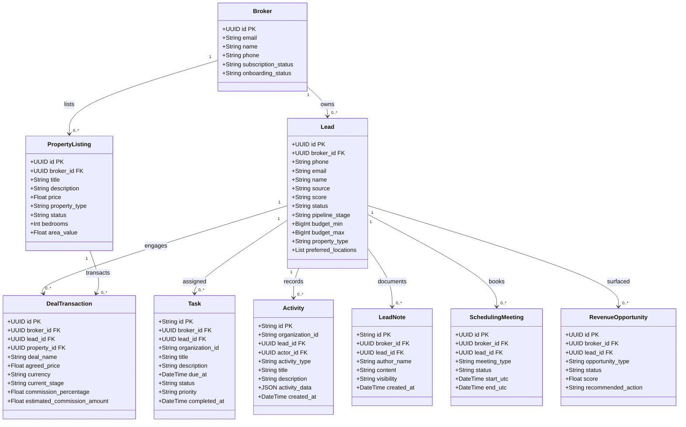

# WEFYLABS PART 14 — NATIVE CRM DATA MODEL SPECIFICATION
============================================================
**Authoritative Domain Model, Relational Schema & State Classification**
*WefyLabs Revenue Operating System*

---

## 1. Domain Model Classification: Authoritative vs Derived vs Reference

The native CRM connects directly to the underlying domain tables. No duplicate "CRMLead" or "CRMCustomer" models exist.

---

## 2. Table Classification Matrix

| Model | Table Name | Status | Authority Type | Isolation Column | Description |
|---|---|---|---|---|---|
| `Broker` | `brokers` | Reused | **AUTHORITATIVE** | `id` | Tenant account identity, subscription, and onboarding status. |
| `Lead` | `leads` | Reused | **AUTHORITATIVE** | `broker_id` | Core customer inquiry, preferences, budget, score, and pipeline stage. |
| `PropertyListing` | `property_listings` | Reused | **AUTHORITATIVE** | `broker_id` | Property OS inventory truth, pricing, area, and bedroom specifications. |
| `DealTransaction` | `deal_transactions` | Reused | **AUTHORITATIVE** | `broker_id` | Sales OS commercial transaction, agreed price, stage, and commission. |
| `Task` | `tasks` | Reused | **AUTHORITATIVE** | `broker_id`, `organization_id` | Operator action items with due dates, priority, and completion timestamps. |
| `Activity` | `activities` | Reused | **AUTHORITATIVE** | `organization_id` | Historical operational interactions (calls, meetings, notes, recommendations). |
| `LeadNote` | `lead_notes` | Reused | **AUTHORITATIVE** | `broker_id` | Operator briefing notes with visibility controls (`internal`, `team`). |
| `SchedulingMeeting` | `scheduling_meetings` | Reused | **AUTHORITATIVE** | `broker_id` | Calendar appointments and physical site visits. |
| `RevenueOpportunity` | `revenue_opportunities` | Reused | **DERIVED** | `broker_id` | High-value commercial interventions generated by Revenue Autopilot. |
| `AuditLog` | `audit_logs` | Reused | **AUTHORITATIVE** | `organization_id`, `actor_id` | Immutable security and regulatory audit log for SOC2/GDPR compliance. |
| `Customer360Response` | *In-Memory DTO* | Created | **DERIVED** | Scoped by tenant | Consolidated single-customer view combining all underlying domain records. |
| `SalesPipelineKanban` | *In-Memory DTO* | Created | **DERIVED** | Scoped by tenant | 11-stage pipeline aggregation with card valuations and stagnation indicators. |

---

## 3. Database Indexes (Alembic Revision: 0029_native_crm_indexes)

To guarantee sub-20ms queries across tenant operations:
1. `ix_leads_broker_status` on `leads (broker_id, status)`: Accelerates active lead filtering.
2. `ix_leads_broker_source` on `leads (broker_id, source)`: Accelerates source attribution filtering.
3. `ix_leads_broker_id_pipeline_stage` on `leads (broker_id, pipeline_stage)`: Powers instant pipeline column grouping.
4. `ix_tasks_broker_due` on `tasks (broker_id, due_at)`: Instant overdue task resolution.
5. `ix_deal_transactions_broker_id` on `deal_transactions (broker_id)`: Rapid pipeline total valuation sums.

---

## 4. Integrity and Zero Duplication Guarantee

- No secondary `CRMCustomer` table was introduced.
- No secondary `CRMLead` table was introduced.
- No secondary `CRMOpportunity` table was introduced.
- No secondary `CRMActivity` table was introduced.
- The UI sits entirely on canonical domain entities with zero duplicate synchronization layers.
