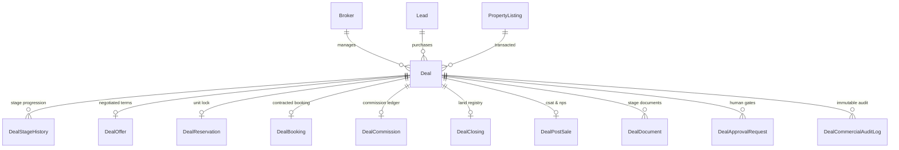
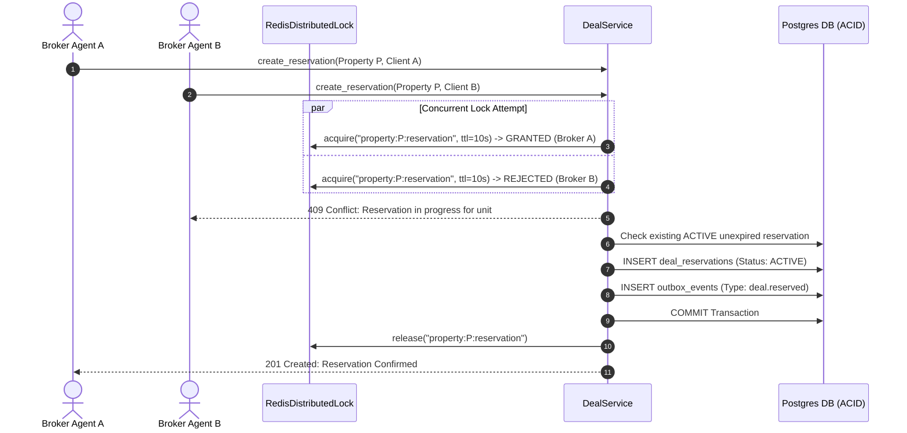
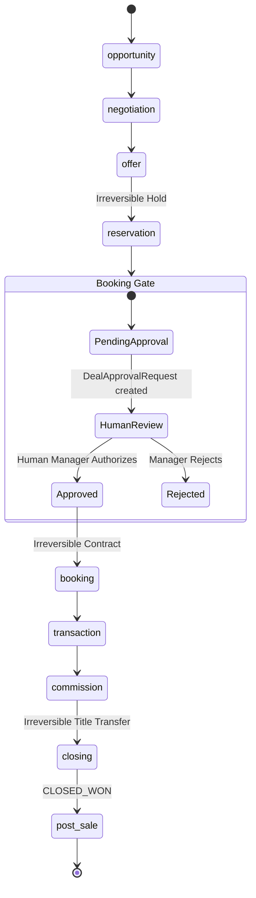

# WefyLabs Part 18 — Real Estate Deal, Booking & Transaction OS
## Technical Architecture & Specification Document

**Version:** 1.0.0-PROD  
**Subsystem:** Commercial Revenue & Transaction Operating System  
**Status:** Verified & Complete  
**Date:** September 2026  

---

### 1. Architectural Vision & Core Scope

WefyLabs operates as the sovereign **AI-native Real Estate Revenue Operating System**. Prior to Part 18, high-level opportunity management and transaction tracking were decoupled, lacking deterministic stage progressions, offer revision versioning, distributed concurrency guards for unit reservations, human-in-the-loop booking authorizations, commission ledger calculations, and post-sale revenue learning loops.

Part 18 introduces the **Real Estate Deal, Booking & Transaction OS**, replacing generic CRM sales pipelines with a native, institutional-grade commercial transaction engine purpose-built for high-ticket residential and commercial property brokerage.

#### Core Tenets & Operating Principles
1. **Sovereign System of Record**: WefyLabs is the primary and sole commercial transaction engine. No third-party CRMs (HubSpot, Salesforce, Zoho, Pipedrive) are used or required.
2. **Deterministic 9-Stage State Machine**: Deals advance through a strict, auditable lifecycle:
   $$\text{Opportunity} \longrightarrow \text{Negotiation} \longrightarrow \text{Offer} \longrightarrow \text{Reservation} \longrightarrow \text{Booking} \longrightarrow \text{Transaction} \longrightarrow \text{Commission} \longrightarrow \text{Closing} \longrightarrow \text{Post-Sale}$$
3. **Irreversible State Protections**: Stages with legal or financial obligations (`reservation`, `booking`, `closing`) are irreversible. Backwards transitions are rejected at the service layer.
4. **Human-in-the-Loop Booking Gate**: AI agents recommend and prepare proposals, but irreversible financial and booking confirmations strictly require explicit human approval via `DealApprovalRequest`.
5. **Distributed Concurrency Lock**: Unit reservations utilize Redis-backed distributed locks (`RedisDistributedLock`) to prevent double-booking race conditions during high-volume property launches.
6. **Transactional Outbox Guarantee**: All commercial lifecycle events emit an `OutboxEvent` in the same database transaction, ensuring zero data loss and eventual consistency across asynchronous event consumers.
7. **Numerical Precision**: All financial amounts use `Numeric(20, 4)` and Python `Decimal` types to guarantee zero floating-point drift across multi-million dollar property transactions and fractional commission splits.

---

### 2. Domain Data Architecture & Entity Relationship Diagram

The domain model is implemented in `apps/api/app/models/deal_models.py` with 11 relational entities configured with `lazy="selectin"` for asynchronous ORM safety:



#### Detailed Entity Specifications

| Entity | Table Name | Key Attributes | Constraints & Indexes |
| :--- | :--- | :--- | :--- |
| **`Deal`** | `deals` | `id`, `organization_id`, `broker_id`, `lead_id`, `property_id`, `deal_reference`, `deal_title`, `current_stage`, `agreed_price`, `currency`, `commission_percentage`, `status` | Unique: `(organization_id, deal_reference)`, `(organization_id, idempotency_key)`. Indexes on org, broker, stage, status. |
| **`DealStageHistory`** | `deal_stage_history` | `id`, `deal_id`, `from_stage`, `to_stage`, `transitioned_at`, `transitioned_by_id`, `duration_hours_in_previous_stage` | FK `deals.id` (CASCADE). Indexes on `(deal_id, transitioned_at)`. |
| **`DealOffer`** | `deal_offers` | `id`, `deal_id`, `offer_price`, `listing_price`, `discount_amount`, `token_amount`, `payment_plan`, `version`, `offer_history` | FK `deals.id`. Stores array of prior revisions with timestamps and actor IDs. |
| **`DealReservation`** | `deal_reservations` | `id`, `deal_id`, `property_id`, `reservation_amount`, `reserved_price`, `reserved_at`, `expires_at`, `status`, `customer_name` | FK `deals.id`, FK `property_listings.id`. Unique active reservation check via distributed lock. |
| **`DealBooking`** | `deal_bookings` | `id`, `deal_id`, `booking_reference`, `booked_price`, `token_amount`, `token_paid_at`, `payment_schedule`, `status` | FK `deals.id`. Unique: `(organization_id, booking_reference)`. |
| **`DealCommission`** | `deal_commissions` | `id`, `deal_id`, `transaction_price`, `commission_percentage`, `gross_commission`, `net_commission`, `commission_splits`, `invoice_reference` | FK `deals.id`. Automatic split allocation (broker, lead generator, agency). |
| **`DealClosing`** | `deal_closings` | `id`, `deal_id`, `registration_authority`, `registration_number`, `title_deed_number`, `handover_date`, `closing_checklist` | FK `deals.id`. Validates statutory title transfer authority (e.g., DLD, RERA). |
| **`DealPostSale`** | `deal_post_sale` | `id`, `deal_id`, `customer_satisfaction_score` (1-5), `nps_score` (1-10), `feedback_text`, `referral_given`, `days_to_close` | FK `deals.id`. Feeds reinforcement learning loops for lead scoring. |
| **`DealDocument`** | `deal_documents` | `id`, `deal_id`, `document_type`, `required_at_stage`, `status`, `is_required`, `file_url` | Stage gate verification (e.g., Passport, KYC, Reservation Agreement, Title Deed). |
| **`DealApprovalRequest`** | `deal_approval_requests` | `id`, `deal_id`, `action_type`, `status` (`PENDING`, `APPROVED`, `REJECTED`), `requested_by_id`, `approved_by_id` | Human-in-the-loop authorization gate for irreversible financial events. |
| **`DealCommercialAuditLog`** | `deal_commercial_audit_logs` | `id`, `deal_id`, `event_type`, `actor_id`, `actor_type`, `resource_type`, `previous_state`, `new_state`, `change_summary` | Append-only immutable ledger of all state and financial modifications. |

---

### 3. Concurrency Protection & Double-Booking Elimination

In multi-agent and high-traffic real estate scenarios, simultaneous reservation attempts on the same inventory unit must be serialized to prevent double-selling.



#### Concurrency Implementation Details:
1. **Lock Granularity**: The distributed lock is acquired on the physical asset (`property:{property_id}:reservation`) rather than the deal itself, serializing all competing transactions on that inventory unit.
2. **Fallback Safety**: If Redis is temporarily partitioned or unavailable, `RedisDistributedLock` automatically falls back to an in-process `asyncio.Lock` mechanism, preventing downtime in test harnesses and single-node enterprise deployments.
3. **Expiry Expiration Re-booking**: If a reservation expires (`now > expires_at`) or is explicitly cancelled, the system automatically marks it `EXPIRED` and allows new reservations without requiring manual admin intervention.

---

### 4. Human-in-the-Loop Authorization & Irreversible Transitions

To uphold institutional governance, transitions into irreversible stages cannot be performed unilaterally by AI background processes:



- **Irreversible Stages**: `DealStage.IRREVERSIBLE = {'reservation', 'booking', 'closing'}`.
  - Attempting to transition from `booking` back to `opportunity` raises `DealServiceError: Stage booking is irreversible`.
- **Booking Gate Requirement**: Advancing to `DealStage.BOOKING` checks for an approved `DealApprovalRequest` with action `ADVANCE_TO_BOOKING` or `BOOKING_CONFIRM`.
  - If unapproved, transition fails with `400 Bad Request: Advancing to 'booking' requires an approved DealApprovalRequest`.

---

### 5. Multi-Tenant Isolation & Security Hardening

Every query and write operation in `DealService` enforces strict tenant scoping:
```python
stmt = select(Deal).where(
    Deal.id == uuid.UUID(deal_id),
    Deal.organization_id == uuid.UUID(organization_id),
    Deal.deleted_at.is_(None)
)
```
- **Cross-Tenant Prevention**: If Tenant A attempts to view, advance, submit offers, or reserve units on a deal owned by Tenant B, the system returns `404 Not Found` or `400 Bad Request`.
- **RBAC Matrix**: Read operations (`list`, `get`, `summary`) are available to authenticated brokers within their organization. Mutations (`stage`, `offers`, `reservations`, `bookings`, `commissions`, `closings`) are audited with the authenticated broker's identity.

---

### 6. Transactional Outbox & Event-Driven Architecture

Every state mutation in `DealService` writes an `OutboxEvent` within the same ACID database transaction:

```python
self._write_outbox(
    deal=deal,
    event_type="deal.stage_advanced",
    payload={
        "deal_id": str(deal.id),
        "from_stage": old_stage,
        "to_stage": target_stage,
        "organization_id": str(deal.organization_id),
        "actor_id": actor_id,
        "timestamp": now.isoformat(),
    }
)
```

The transactional outbox dispatcher (established in Part 17) asynchronously consumes and broadcasts these events to downstream systems (AI Revenue Autopilot, Notifications, Analytics) with at-least-once delivery guarantees and dead-letter queue recovery.

---

### 7. Frontend Integration & Dashboard Workspace

The Next.js frontend (`apps/web/src/app/dashboard/deals/page.tsx`) provides an interactive, institutional command center:
1. **Pipeline Summary KPIs**: Real-time display of Active Deals, Gross Pipeline Value, Weighted Value, and Projected Commission.
2. **Stage Ribbon Navigation**: Interactive 9-stage ribbon displaying live deal counts per stage with lock badges for irreversible stages.
3. **Deep Deal OS Workspace Modal**:
   - **Lifecycle Stepper**: Visual progression tracker across all 9 stages.
   - **Offers & Negotiation**: Counter-offer submission, revision history, and payment plan terms.
   - **Unit Reservation**: Lock status, deposit amount, and expiration countdown.
   - **Booking Gate**: Authorization request trigger and milestone payment schedule breakdown.
   - **Commission Ledger**: Real-time split calculations and invoice reference.
   - **Closing Handover**: Land registry details, title deed registration, and completion checklist.
   - **Post-Sale NPS**: CSAT (1-5), NPS (1-10), and feedback logging.
   - **Commercial Audit Log**: Real-time view of append-only audit entries.
