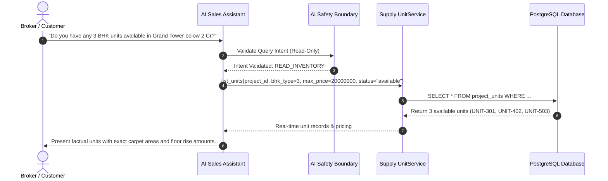

# WEFYLABS AI INVENTORY INTELLIGENCE & SAFETY BOUNDARY SPECIFICATION
## Natural Language Inventory Discovery, Factual Grounding & Autonomous Action Guardrails

---

## 1. Core Principle & Non-Negotiable Boundary

In the WefyLabs architecture, AI models and autonomous agents serve as **Intelligence Assistants and Natural Language Query Engines**, never as autonomous transaction signers or balance sheet committers.

> **CRITICAL ARCHITECTURAL INVARIANT**:
> **No autonomous AI bookings, unit holds, price reductions, or commission alterations may occur without explicit, authenticated human broker or developer manager approval.**

---

## 2. Permitted Capabilities vs. Prohibited Actions

| Domain | Allowed AI Operations (Factual & Assisting) | Prohibited AI Operations (Autonomous Escalation) |
| :--- | :--- | :--- |
| **Inventory Discovery** | Semantic search by BHK, carpet area, facing direction, budget, and possession timeline. | Hallucinating phantom units or unreleased inventory. |
| **Availability Checks** | Real-time querying of actual database status (`AVAILABLE`, `RESERVED`, `SOLD`). | Overriding live locks or reporting reserved units as available. |
| **Pricing & Costing** | Reading official `ProjectPriceBook` entries, calculating standard price breakdowns (carpet + floor rise + amenities). | Autonomously altering base prices, waiving fees, or granting unapproved discounts. |
| **Lead Registration** | Assisting brokers in drafting lead details for first-touch attribution. | Autonomously registering leads or overriding attribution lockups. |
| **Unit Booking** | Generating reservation summaries and preparing payment links for human review. | Transitioning unit status to `RESERVED` or `BOOKED` autonomously. |
| **Commission Calculations** | Estimating potential co-broking payouts according to active `ChannelPartnerProjectAgreement`. | Authorizing commission payouts or modifying agreement percentages. |

---

## 3. Natural Language Inventory Query Engine

The AI Inventory Assistant interfaces with `apps/api/app/modules/inventory/service.py::UnitService` through structured function calling:

---

## 4. Safety Guardrails & Validation in Automated Tests

The enforcement of this boundary is directly verified by the test suite:
- **Test File**: `tests/test_part19_ai_inventory.py`
  1. `test_ai_inventory_query_factual_availability`: Confirms that the AI inventory query tool queries actual database state and reports true unit availability without hallucinating.
  2. `test_ai_cannot_autonomously_book_without_approval`: Asserts that an autonomous booking attempt generated by an AI assistant payload is blocked, requiring explicit human broker authentication and signature.
