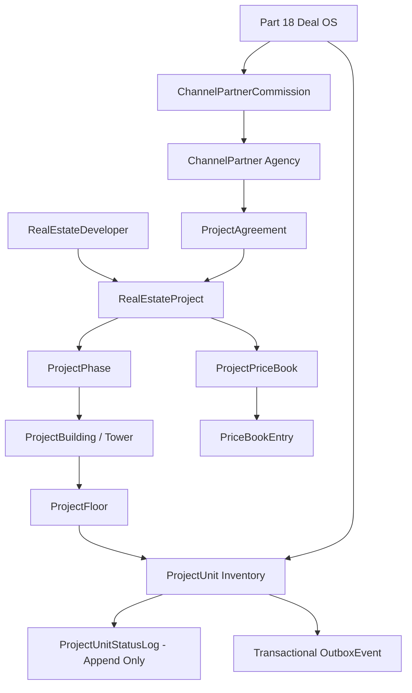

# WEFYLABS SUPPLY SIDE INVENTORY OS: ARCHITECTURE & SPECIFICATION
## Institutional Real Estate Supply, Projects, Units & Channel Partner Operating System

---

## 1. System Topology & Architectural Invariant

The WefyLabs Supply OS establishes the institutional physical and commercial foundation of real estate inventory:

---

## 2. Core Supply Entities & Relational Hierarchy

### 1. Developer Entity (`RealEstateDeveloper`)
- **Table**: `real_estate_developers`
- **Tenant Scope**: Strict `organization_id` isolation.
- **Attributes**: `developer_code`, `legal_name`, `trade_name`, `rera_number`, `cin_number`, `pan_number`, `gst_number`, `status`, `years_in_business`, `rating`.

### 2. Project Entity (`RealEstateProject`)
- **Table**: `real_estate_projects`
- **Hierarchical Anchor**: Belongs to `RealEstateDeveloper`, contains phases, towers, and units.
- **Real-Time Counters**: `total_units`, `available_units`, `reserved_units`, `booked_units`, `sold_units`.
- **RERA Compliance**: Authoritative RERA license registration, launch date, expected completion date, and possession status.

### 3. Nested Building Structure
- `ProjectPhase`: Phased development stages.
- `ProjectBuilding`: Towers or blocks.
- `ProjectFloor`: Vertical floor mapping for high-rise residential & commercial inventory.

### 4. Unit as First-Class Commercial Inventory (`ProjectUnit`)
- **Table**: `project_units`
- **Identifiers**: `unit_code` (unique, human-readable, e.g. `UNIT-A101`), `unit_number`.
- **Space Dimensions**: `carpet_area`, `built_up_area`, `super_built_up_area` stored as high-precision decimals with explicit `area_unit` (`sqft`, `sqm`).
- **Pricing & Economics**: `base_price`, `price_per_sqft`, `floor_rise_amount`, `amenity_charges`, `parking_charges`, `total_price` all stored as `Numeric(20, 4)`.

---

## 3. Server-Authoritative State Machine & Concurrency

### Deterministic State Transitions
$$\text{available} \to \{\text{reserved}, \text{blocked}, \text{under\_offer}\}$$
$$\text{reserved} \to \{\text{available}, \text{booked}, \text{blocked}\}$$
$$\text{under\_offer} \to \{\text{reserved}, \text{available}, \text{booked}\}$$
$$\text{booked} \to \{\text{sold}, \text{returned}\}$$
$$\text{returned} \to \{\text{available}\}$$
$$\text{blocked} \to \{\text{available}\}$$
$$\text{sold} \to \emptyset \quad \text{(Terminal)}$$

- **Locking**: Distributed locking on `inventory:unit:{unit_id}:reservation` via `RedisDistributedLock` serializes concurrent reservation attempts across API instances.
- **Auditability**: Every mutation writes an immutable row into `project_unit_status_logs` and publishes an `OutboxEvent` (`inventory.unit.<status>`) inside the database transaction.

---

## 4. Channel Partner Network & Commission Architecture

1. **Partner Accreditation & KYC**:
   - `ChannelPartner` entities enter with `pending_kyc` status.
   - Payout calculations and lead registration require explicit compliance verification (`kyc_verified=True`).
2. **Project Agreements (`ChannelPartnerProjectAgreement`)**:
   - Contractual project marketing mandates with agreed commission rates (e.g. 2.5%), valid date ranges, and exclusivity markers.
3. **First-Touch Attribution Engine**:
   - Partner lead registration verifies customer identity (phone/email).
   - If lead already exists in CRM, existing attribution is strictly preserved, preventing duplicate partner conflicts.
4. **Commission Accounting**:
   - Commission ledgers (`ChannelPartnerCommission`) store base transaction value, commission percentage, GST, TDS, and net payable in `Numeric(20, 4)`.
