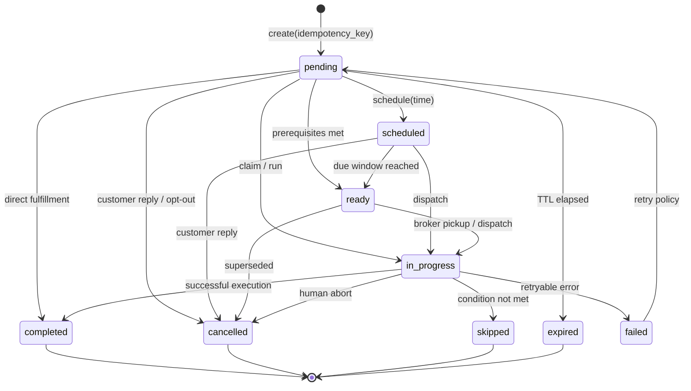

# WEFYLABS ARCHITECTURE — FOLLOW-UP ENGINE & WORKITEM STATE MACHINE (BUILD 07)

## 1. Executive Summary

The Build 07 Follow-Up Engine establishes an accountable, idempotent work management system. It replaces scattered task creation across SLA services, autonomous loops, and marketing scripts with a single canonical `WorkItemService` backed by the extended `Task` model and `Commitment` engine.

---

## 2. Canonical WorkItem Model & State Machine

Every task, follow-up, call-back, and reminder is a `Task` (WorkItem) governed by strict state transitions:

### Controlled Vocabularies
- **WorkItem Types**: `FOLLOW_UP`, `CALL_BACK`, `SEND_MESSAGE`, `SEND_PROPERTY`, `ASK_QUESTION`, `APPOINTMENT_CONFIRMATION`, `SITE_VISIT_CONFIRMATION`, `POST_VISIT_FOLLOW_UP`, `DOCUMENT_REQUEST`, `DOCUMENT_REMINDER`, `NEGOTIATION_FOLLOW_UP`, `REENGAGEMENT`, `HUMAN_HANDOFF`, `INTERNAL_REVIEW`.
- **WorkItem Sources**: `CUSTOMER_REQUEST`, `AI_RECOMMENDATION`, `WORKFLOW`, `SYSTEM_SLA`, `HUMAN_AGENT`, `APPOINTMENT`, `SITE_VISIT`, `PROPERTY_INTERACTION`, `REENGAGEMENT_RULE`.

---

## 3. Golden Path 100: Auto-Cancellation on Customer Reply

When an inbound message arrives from a customer:
1. `cancel_pending_for_lead(lead_id, organization_id)` is invoked immediately.
2. All pending or scheduled automated follow-ups for that lead are marked `cancelled`.
3. An immutable timestamp (`cancelled_at`) and audit reason (`"Customer replied via WhatsApp — superseded by active dialogue"`) are recorded.
4. This guarantees that brokers or AI never send conflicting or stale nudges while actively talking to the client.

---

## 4. Commitment Engine (Company vs. Customer)

The `Commitment` model distinguishes between:
- **Company Commitments** (`owner="COMPANY"`): "I'll send the brochure in 10 minutes."
  - Automatically spawns an accountable, high-priority WorkItem.
  - Monitored for SLA breaches.
- **Customer Commitments** (`owner="CUSTOMER"`): "I will send bank pre-approval tomorrow."
  - Spawns a passive monitoring task (checking 2 hours after deadline).
  - Never confuses customer promises with sales agent obligations.
