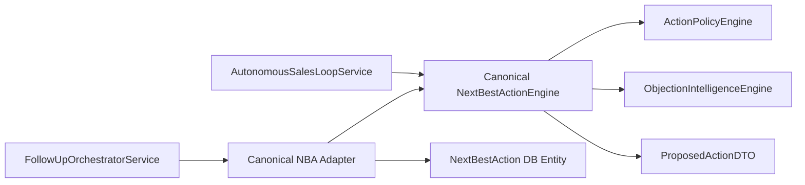

# WEFYLABS ARCHITECTURE — CANONICAL NEXT-BEST-ACTION (NBA) ENGINE (BUILD 07)

## 1. Executive Summary

The Next-Best-Action (NBA) Engine is the deterministic decision core of WefyLabs. It replaces legacy fragmented heuristic scripts with a single unified hierarchy governing all automated customer touchpoints. LLMs are never allowed to decide *what* action to take; LLMs only draft *how* to say it once the NBA has chosen the action type.

---

## 2. Priority Hierarchy

The NBA evaluates input events, qualification profiles, objections, and compliance rules in strict priority order:

| Priority | Action Type | Urgency | Risk Tier | Condition |
|---|---|---|---|---|
| **1** | `HANDOFF_HUMAN` / `WAIT` | Urgent | LOW | Customer requests human broker, expresses anger, or human agent is active. |
| **2** | `WAIT` (Opt-Out) | Immediate | LOW | Customer says STOP / unsubscribe / revokes consent. Halts all automation. |
| **3** | `HANDLE_OBJECTION` | High | MEDIUM | Active objection detected (Price, Location, Timing, Developer, etc.). |
| **4** | `SCHEDULE_APPOINTMENT` | High | HIGH | Customer indicates visit/viewing intent or scheduling interest. |
| **5** | `ANSWER_QUESTION` | Medium | LOW | Factual property or market question asked with grounded evidence available. |
| **6** | `ASK_QUALIFICATION` | Medium | MEDIUM | Missing essential qualification fact (budget, bedrooms, timeline, location). |
| **7** | `SEND_PROPERTY` | Medium | MEDIUM | Customer is qualified and verified inventory matches are available. |
| **8** | `FOLLOW_UP` | Low | HIGH | Proactive follow-up due per cadence policy. |
| **9** | `WAIT` | Low | LOW | Default listen state awaiting customer reply. |

---

## 3. Convergence Adapter Architecture

- **Unified Single Source of Truth**: `app/modules/ai_agent/next_best_action.py` contains the authoritative decision logic.
- **Backward Compatibility**: `app/modules/follow_up/next_best_action/nba_calculator.py` adapts the canonical engine to persist `NextBestAction` records without rewriting legacy consumers.
- **Auditable Evidence**: Every action emitted contains structured evidence (`matched_phrase`, `category`, `missing_fields`, `trigger_message`) rather than opaque scores.
