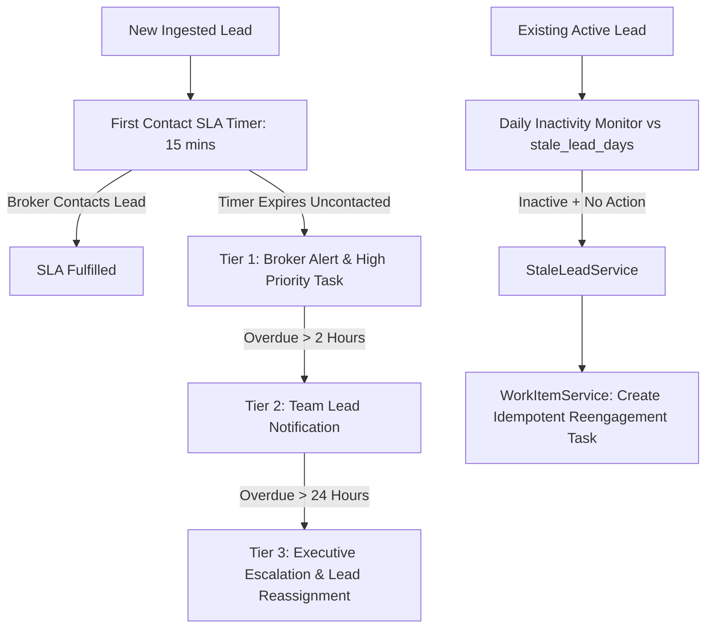

# WEFYLABS ARCHITECTURE — SLA & REVENUE CONTINUITY ENGINE (BUILD 07)

## 1. Executive Summary

The SLA & Revenue Continuity Engine prevents deal decay and silent churn by enforcing the core Build 07 invariant:

> **"AN ACTIVE LEAD MUST ALWAYS HAVE A VALID NEXT-BEST-ACTION OR SCHEDULED WORK ITEM."**

Leads with no pending task, or with overdue tasks exceeding policy thresholds, trigger automated alerts, re-engagement WorkItems, or broker escalations.

---

## 2. Staleness & SLA Invariant Matrix

| Inactivity (Days) | Active WorkItem Present? | Task Due Status | Classification | Automated Action |
|---|---|---|---|---|
| `< stale_lead_days` | Yes | Future / Ready | `ACTIVE_HEALTHY` | Maintain schedule. |
| `< stale_lead_days` | No | None | `HEALTHY_BUT_NO_ACTION` | Prompt broker or auto-schedule next check-in. |
| `>= stale_lead_days` | No | None | `STALE_NO_ACTION` | Flag revenue at risk; auto-create `REENGAGEMENT` WorkItem. |
| `>= stale_lead_days` | Yes | Overdue (`due_at < now`) | `STALE_OVERDUE_ACTION` | Escalate to manager; flag SLA breach. |
| Any | N/A | Terminal (`LOST`, `CONVERTED`) | `TERMINAL_STAGE` | No action required. |

---

## 3. SLA Service Architecture & Tiered Escalations

### SLA Policy Parameters (Per Tenant)
- `first_contact_sla_minutes`: Default 15 mins.
- `hot_lead_sla_minutes`: Default 30 mins for qualified high-intent leads.
- `escalation_delay_hours`: Default 2 hours.
- `manager_escalation_hours`: Default 24 hours.
- `stale_lead_days`: Default 7 days.
- `reengagement_days`: Default 14 days.
