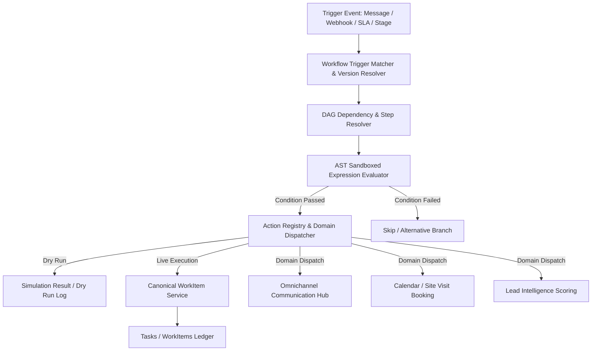

# WEFYLABS ARCHITECTURE — WORKFLOW ORCHESTRATION OS (BUILD 07)

## 1. Executive Summary

WefyLabs Workflow Orchestration OS provides declarative, multi-step business process automation across communication, scoring, CRM lifecycle, calendars, and AI-driven tasks. It links event streams (incoming customer messages, property status changes, SLA timer expirations, stage movements) to deterministic directed acyclic graph (DAG) executions.

---

## 2. Core Architecture

---

## 3. Key Components

### 3.1 Sandboxed Expression Evaluator
- AST-parsed, deterministic expression evaluation over payload attributes (`lead.budget_max`, `lead.stage`).
- **Zero eval() or exec()**: Eliminates arbitrary code execution vulnerabilities.
- Handles comparisons (`==`, `!=`, `>`, `<`, `>=`, `<=`, `in`, `contains`, `between`) and composite boolean logic (`AND`, `OR`, `NOT`).

### 3.2 Action Registry & Canonical Dispatch
- Central catalog of invocable workflow actions (`crm.create_task`, `communication.send_whatsapp`, `calendar.book_viewing`, `scoring.evaluate_lead`).
- Dispatches to canonical domain services while maintaining strict tenant isolation.
- Integrated directly with Build 07 `WorkItemService` to ensure all task creation produces traceable, deduplicated WorkItems.

### 3.3 Simulation & Dry-Run Mode
- Allows admins and brokers to test workflow definitions against historical or mock lead payloads before activation.
- Emits dry-run audit logs without dispatching external WhatsApp messages, emails, or state mutations.

### 3.4 Concurrency & Failure Recovery
- State machine tracks `PENDING -> IN_PROGRESS -> COMPLETED / FAILED`.
- Retries with exponential backoff on transient network faults.
- Dead-letter routing for persistent failures with full correlation IDs.
