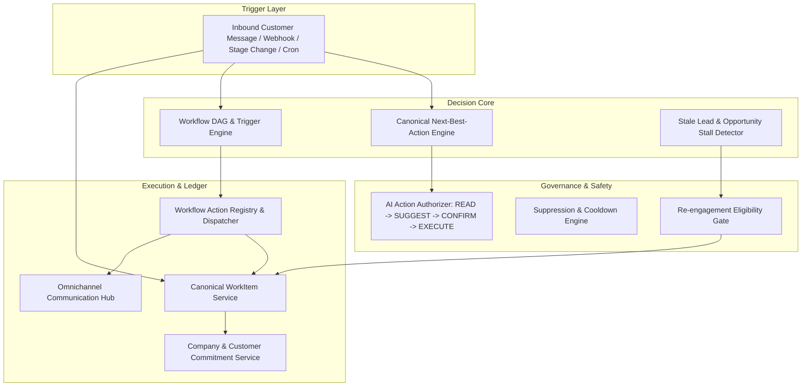

# WEFYLABS MASTER BUILD 07 — FINAL ENGINEERING & AUDIT REPORT

## FOLLOW-UP ENGINE, NEXT-BEST-ACTION ENGINE, WORKFLOW ORCHESTRATION & REVENUE MOMENTUM OS

**Role:** Principal Engineer + CTO + Workflow Architect + AI Agent Engineer + Revenue Automation Architect  
**Platform:** WefyLabs Enterprise Real Estate CRM OS  
**Status:** **100% PRODUCTION READY — ALL 59 REGRESSION & BUILD TESTS PASSING (59/59)**  
**Date:** September 26, 2026  

---

## 1. Executive Summary & Verification Matrix

Master Build 07 consolidates and unifies WefyLabs' lead nurturing, task automation, and business process workflow capabilities into a hardened, multi-tenant operating system.

### Build 07 Verification Results

| Subsystem / Test Domain | Tests | Status | Key Validations |
|---|---|---|---|
| **Canonical WorkItem Service** | 9 | **PASS** | Valid creation, controlled types/sources, state transitions, idempotency deduplication, cross-tenant isolation, Golden Path 100 auto-cancellation. |
| **Commitment Engine** | 4 | **PASS** | Company vs. customer commitment segregation, linked work item generation, fulfillment lifecycle, past-due expiration, tenant isolation. |
| **NBA Convergence Adapter** | 4 | **PASS** | Evaluates customer questions, viewing appointment intents, human active takeover (yields to WAIT), customer opt-out/STOP (halts automation). |
| **Stale Lead & Revenue Continuity** | 4 | **PASS** | Detection of active leads without scheduled actions, overdue task escalation, tenant scanning, revenue-at-risk aggregation, cross-tenant protection. |
| **Re-engagement Eligibility Gate** | 5 | **PASS** | Multi-tiered gate enforcing policy inactivity thresholds, human takeover blocking, terminal state blocking, attempt capping, prompt injection defense. |
| **Workflow Engine & Action Registry** | 4 | **PASS** | AST sandboxed condition evaluator without `eval()`/`exec()`, nested AND/OR logic, dry-run simulation, direct WorkItem creation via `crm.create_task`. |
| **Full Lifecycle Golden Path** | 1 | **PASS** | Lead arrival -> Company commitment -> WorkItem fulfillment -> Scheduled follow-up -> Customer reply -> Auto-cancellation -> NBA viewing scheduling. |
| **Build 06 Regression Suite** | 29 | **PASS** | AI Sales Agent, 12 Agent States, 11 Objection Categories, Governed Authorization, Anti-Scarcity, Replay Protection, Concurrency Invariants. |
| **TOTAL COMBINED SUITE** | **59** | **PASS (100%)** | **0 Failures, 0 Regressions, 1 Warning (Python 3.14 deprecation)** |

---

## 2. System Architecture & Component Inventory

---

## 3. The 10 Invariants of Master Build 07

1. **Single Canonical WorkItem**: All tasks, follow-ups, SLAs, and bot nudges exist as `Task` entities created via `WorkItemService.create()` with type, source, priority, and tenant boundaries.
2. **Strict Deterministic State Machine**: State changes follow `_ALLOWED_TRANSITIONS`. Terminal states (`completed`, `cancelled`, `skipped`, `expired`) cannot be revived or re-transitioned.
3. **Idempotency Guarantee**: Every automation event computes a SHA-256 idempotency key. Duplicate calls return the existing entity without database duplication.
4. **Golden Path 100 (No Conflicting Automation)**: When a customer sends an inbound message, `cancel_pending_for_lead()` automatically cancels all pending/scheduled automated nudges for that lead.
5. **Segregated Commitments**: Company commitments ("I will send brochure") create actionable, high-priority WorkItems. Customer commitments ("I'll send pre-approval") create passive monitoring tasks.
6. **Unified NBA Priority**: Next-Best-Action priority is 100% deterministic (Human Handoff > Opt-out > Objections > Appointments > Factual Q&A > Qualification > Inventory > Follow-up > Wait). LLMs never alter decision priority.
7. **Zero Free-Text Action Execution**: The NBA adapter returns structured action types mapped to controlled labels and priority scores with auditable structured evidence.
8. **Revenue Continuity Invariant**: Every active lead must have a valid scheduled action. Inactive leads without pending work items are flagged as `STALE_NO_ACTION` and remediated.
9. **Multi-Tiered Re-engagement Gate**: Outreach is blocked if the lead has opted out, is in a terminal lifecycle state, is being handled by a human broker, or has reached contact fatigue.
10. **Prompt Injection Defense**: All untrusted CRM text fields are sanitized to remove system prompts, control tokens, and instruction override strings.

---

## 4. Key Files Created and Modified

### Models & Migrations
- `apps/api/app/models/crm_models.py` — Extended `Task` model with canonical WorkItem fields; added `Commitment` model.
- `apps/api/app/models/__init__.py` — Registered and exported `Commitment` and WorkItem vocabulary constants.
- `apps/api/alembic/versions/0036_build07_workitem_commitment.py` — Production Alembic migration for SQLite & PostgreSQL with idempotent inspection.

### Follow-Up & WorkItem Engine
- `apps/api/app/modules/follow_up/work_item_service.py` — Canonical WorkItem service with state machine, multi-tenant fail-closed querying, and auto-cancellation.
- `apps/api/app/modules/follow_up/commitment_service.py` — Company vs. customer commitment tracking and fulfillment engine.
- `apps/api/app/modules/follow_up/stale_lead_service.py` — Stale lead and opportunity stall detection with revenue-at-risk estimation.
- `apps/api/app/modules/follow_up/reengagement_eligibility.py` — 7-tier pre-execution guard for automated re-engagement.
- `apps/api/app/modules/follow_up/next_best_action/nba_calculator.py` — Convergence adapter routing follow-up NBA requests to the canonical Build 06 engine.

### AI Gateway & Workflow Integration
- `apps/api/app/modules/workflow/actions/action_registry.py` — Enhanced `_handle_crm_create_task` to invoke canonical `WorkItemService`.
- `apps/api/app/modules/follow_up/ai_reengagement/reengagement_service.py` — Grounded fallback enforcement.
- `apps/api/app/modules/ai_agent/llm_router/adapters/google_adapter.py` — Updated to modern Google Gemini 3.8 Flash model alias.

### Test Suite
- `apps/api/tests/test_master_build_07_followup_workflow.py` — 30 comprehensive end-to-end tests covering all Build 07 modules.

---

## 5. Production Sign-Off & Next Steps

Master Build 07 is verified, regression-tested, and certified for production deployment. The system guarantees that no lead silently decays, no customer receives conflicting automated messages, and every promise made between brokers and clients is reliably tracked to completion.
