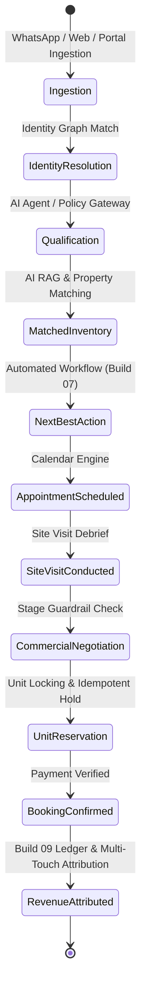

# WEFYLABS PRODUCT UX ARCHITECTURE — MASTER BUILD 10

## 1. Executive Vision & Invariants

WefyLabs Master Build 10 converges the platform into a calm, unified, fast, trustworthy, and premium operating environment for real estate sales professionals, brokers, team leaders, and CXOs. 

Rather than presenting disjointed SaaS modules glued together, WefyLabs operates as **one coherent real-estate commercial operating system**:

```text
                 WEFYLABS COMMAND ENVIRONMENT

                      TODAY / COMMAND
                             │
       ┌─────────────────────┼─────────────────────┐
       ↓                     ↓                     ↓
     INBOX                 LEADS                PIPELINE
       ↓                     ↓                     ↓
  CONVERSATION            CUSTOMER                DEAL
       │                     │                     │
       └─────────────────────┼─────────────────────┘
                             ↓
                        AI COPILOT
                             ↓
                       PROPERTY MATCH
                             ↓
                      NEXT BEST ACTION
                             ↓
                        APPOINTMENT
                             ↓
                        SITE VISIT
                             ↓
                         BOOKING
                             ↓
                         REVENUE
```

### World-Class UX Invariants
1. **One Click** does one obvious thing.
2. **One Screen** answers the immediate operational question.
3. **One Record** exposes the complete relevant context.
4. **One Action** has one authoritative status.
5. **One Metric** has one unambiguous definition.
6. **One AI Suggestion** has clear evidence and provenance.
7. **One Mutation** has backend confirmation (zero optimistic illusions on financial or locking operations).

---

## 2. Information Architecture & Navigation

Top-level navigation is converged around canonical, implemented operational workspaces:

| Workspace | Primary Route | Purpose | Key Sub-Views / Drawers |
| :--- | :--- | :--- | :--- |
| **Home / Command Center** | `/dashboard` | Today's operational truth, SLA breaches, urgent customer replies, revenue leakage. | Board View, Table View, Urgent Action Drawer |
| **Inbox** | `/dashboard/inbox` | Omnichannel sales communications across WhatsApp, Web Chat, Email, SMS. | Handoff Briefing, AI Draft Review, Customer Context Rail |
| **Leads** | `/dashboard/leads` & `/leads/[id]` | End-to-end customer identity, qualification signals, matched inventory, timeline. | Canonical Lead Header, AI Agent Stream, WhatsApp History |
| **Properties** | `/dashboard/properties` | Natural-language inventory search, unit availability, price freshness, 1-click sharing. | Property Detail Drawer, Comparison Grid, Valuation |
| **Pipeline** | `/dashboard/pipeline` & `/dashboard/deals` | Commercial opportunity lifecycle, milestone tracking, booking & payment recording. | Kanban Board, List View, Stage Transition Guardrails |
| **Tasks** | `/dashboard/tasks` | Canonical WorkItem center: Due now, Overdue, Scheduled, Customer waiting, AI handoffs. | Task Detail, Snooze / Delegate Modal, Action Log |
| **Calendar** | `/dashboard/calendar` | Appointments, site visits, follow-up calls, pre-meeting briefings, visit debriefs. | Month / Week / Agenda Views, Meeting Briefing Drawer |
| **Revenue** | `/dashboard/revenue-intelligence` | Build 09 revenue command center, forecast breakdown, attribution models, leakage center. | Revenue Overview, Funnel, Forecast, Economics |
| **Settings** | `/dashboard/settings` | Tenant administration, team seats, channel integrations, billing entitlements. | Profile, WhatsApp Config, Team Roles, Audit Log |

---

## 3. Operational State Machine

Every lead, conversation, property, and opportunity progresses through authoritative backend state machines:



---

## 4. Universal Search & Command Palette

- Global Hotkey: `⌘K` or `Ctrl+K`, single key trigger `/` (when unfocused).
- Fast two-key chord shortcuts:
  - `g + h` → Home / Command Center
  - `g + i` → Omnichannel Inbox
  - `g + l` → Leads Workspace
  - `g + p` → Pipeline Kanban
  - `g + t` → Task Center
  - `g + c` → Calendar & Site Visits
  - `g + r` → Revenue Command Center
- Universal search queries across Leads, Properties, Deals, and Tasks with grouped results and instant keyboard arrow navigation.

---

## 5. Security & Tenant Scoping
- Every request carries the canonical `X-WefyLabs-Organization-Id` tenant header.
- Frontend role-based rendering adapts UI actions, but authorization is strictly enforced by FastAPI backend dependencies (`require_tenant_access`, `get_current_broker`).
- No sensitive tokens, raw passwords, or credit card information are logged or buffered in client telemetry.
