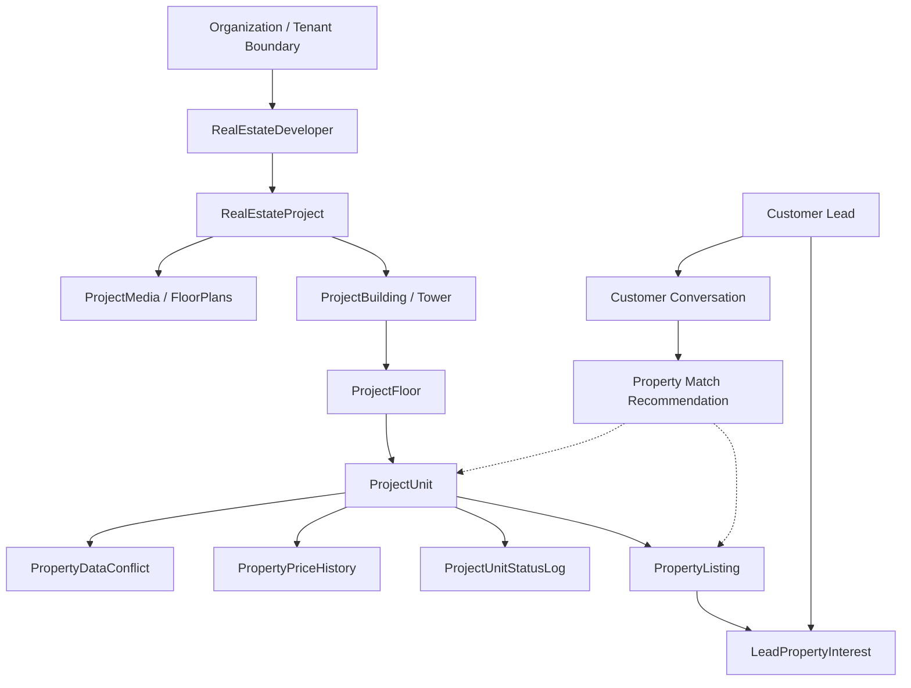

# WEFYLABS REAL ESTATE INTELLIGENCE GRAPH

**Build:** Master Build 04  
**Status:** Canonical Graph Topology  
**Layer:** Relationship & Intelligence Graph Specification  

---

## 1. Graph Topology Overview

The WefyLabs Real Estate Intelligence Graph connects physical property assets with supply-side corporate entities, commercial marketing syndications, and demand-side customer conversations:

---

## 2. Core Entities and Vertex Schemas

| Entity Vertex | Key Properties | Scope & Integrity |
| :--- | :--- | :--- |
| **`Organization`** | `id`, `name`, `status`, `created_at` | Root boundary for all tenant isolation |
| **`Developer`** | `id`, `developer_name`, `developer_code`, `status` | Scoped to `organization_id` |
| **`Project`** | `id`, `project_name`, `city`, `locality`, `rera_number`, `lat`, `lng` | Scoped to Developer & Organization |
| **`Building`** | `id`, `building_name`, `total_floors`, `construction_status` | Scoped to Project |
| **`Floor`** | `id`, `floor_number`, `floor_name` | Scoped to Building |
| **`Unit`** | `id`, `unit_number`, `unit_code`, `inventory_status`, `base_price` | Canonical physical identity |
| **`Listing`** | `id`, `title`, `price`, `status`, `amenities`, `locality` | Multi-channel commercial view |
| **`Lead`** | `id`, `name`, `phone`, `budget_min`, `budget_max`, `locations` | Demand-side customer context |

---

## 3. Canonical Edge Definitions

### Structural Edges (Physical Real Estate Hierarchy)
- `(Developer)-[:OWNS]->(Project)`
- `(Project)-[:CONTAINS]->(Building)`
- `(Building)-[:HAS_LEVEL]->(Floor)`
- `(Floor)-[:HOUSES]->(Unit)`

### Exposure & Marketing Edges
- `(Unit)-[:EXPOSED_VIA]->(Listing)`
- `(Listing)-[:FEEDS]->(Channel: 99acres | Housing | Website | Direct)`

### Demand & Revenue Edges
- `(Lead)-[:EXPRESSED_PREFERENCE]->(Requirement)`
- `(Requirement)-[:MATCHES_UNIT {score, rank}]->(Unit)`
- `(Conversation)-[:DISCUSSED_PROPERTY]->(Listing)`
- `(Lead)-[:RESERVED_UNIT {expires_at, token}]->(Unit)`

---

## 4. Reverse Matching & Traversal Queries

The Intelligence Graph enables multi-directional queries:

1. **Forward Match (Lead → Property):**
   Given a customer lead with budget ₹1.2 Cr in Gurgaon seeking a 3 BHK, traverse active `AVAILABLE` units in matching projects, filter by hard constraints, and rank via compatibility scoring.
2. **Reverse Match (Inventory → Leads):**
   When a developer drops prices on 10 units of Tower B or launches a new phase, traverse all active leads whose expressed preferences match the updated unit inventory, generating targeted notification dispatches.
3. **Staleness Propagation:**
   When a project possession date is delayed, all descendant buildings and units inherit updated possession estimates across active lead proposals.
