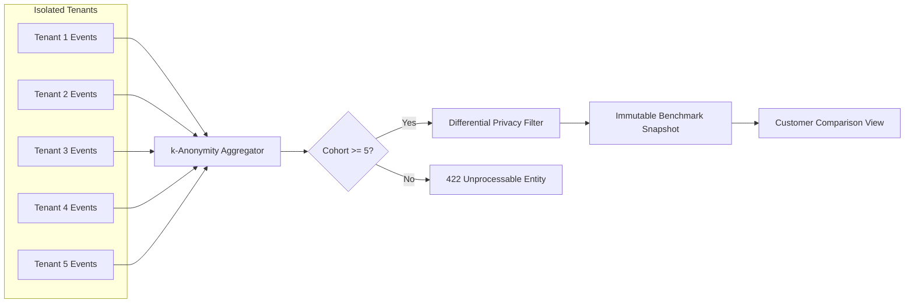

# WefyLabs Privacy-Preserving Benchmarking Engine

## 1. Principles of Enterprise Benchmarking
1. **Zero Customer PII Exposure**: Customer names, lead phones, agent private records, and proprietary deal terms must never appear in global benchmark views.
2. **Strict Minimum Cohort Enforcement ($k \ge 5$)**: The system mathematically rejects any benchmark generation where fewer than 5 unique tenant organizations constitute the peer cohort.
3. **No Synthetic Benchmarks**: Benchmarks are strictly derived from real, verified operational events. Fabricating numbers is prohibited by architectural policy.
4. **Disclosed Uncertainty**: Every benchmark displays sample size, time window, statistical methodology, and confidence intervals.

## 2. Statistical Methodology
- **Quartile Distributions**: Storing P25, P50 (Median), P75, and P90 values prevents skewed distributions caused by outlier mega-deals.
- **Parametric vs Non-Parametric**: Median and IQR are preferred over arithmetic means due to the long-tail nature of real estate sales cycles.



## 3. Benchmark Snapshot Schema
```python
class BenchmarkSnapshot(Base):
    __tablename__ = "benchmark_snapshots"

    id: Mapped[str] = mapped_column(String(36), primary_key=True, default=_gen_uuid)
    definition_id: Mapped[str] = mapped_column(String(36), nullable=False)
    cohort_size: Mapped[int] = mapped_column(Integer, nullable=False)
    p25_value: Mapped[Decimal] = mapped_column(Numeric(12, 4), nullable=False)
    p50_value: Mapped[Decimal] = mapped_column(Numeric(12, 4), nullable=False)
    p75_value: Mapped[Decimal] = mapped_column(Numeric(12, 4), nullable=False)
    p90_value: Mapped[Decimal] = mapped_column(Numeric(12, 4), nullable=False)
    confidence_interval_low: Mapped[Optional[Decimal]] = mapped_column(Numeric(12, 4), nullable=True)
    confidence_interval_high: Mapped[Optional[Decimal]] = mapped_column(Numeric(12, 4), nullable=True)
    is_anonymized: Mapped[bool] = mapped_column(Boolean, default=True, nullable=False)
    computed_at: Mapped[datetime] = mapped_column(DateTime(timezone=True), nullable=False)
```
