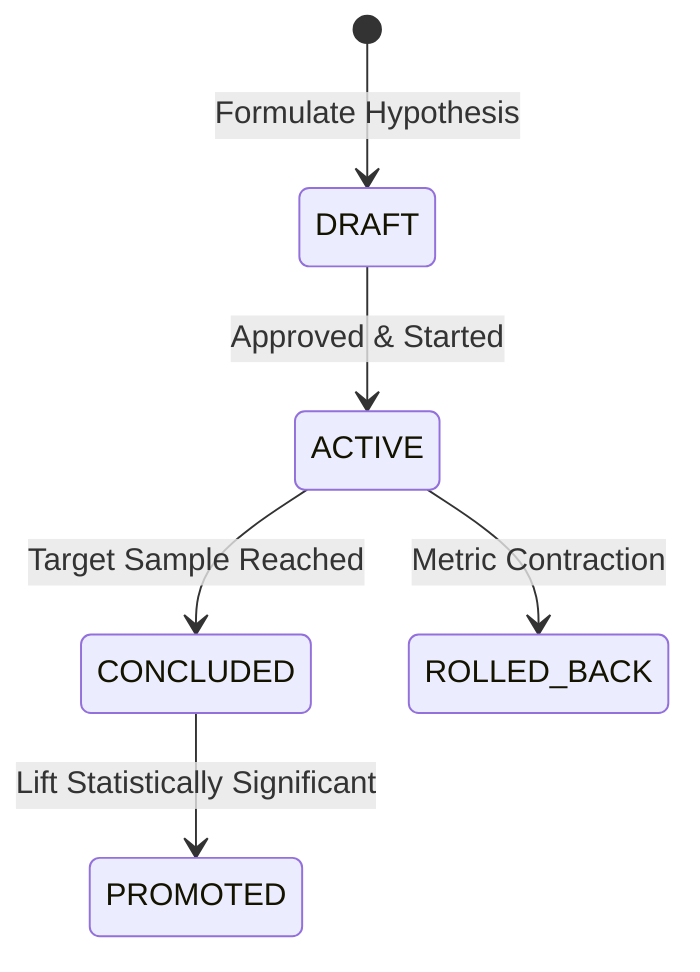

# WefyLabs Controlled Experimentation Engine

## 1. Principles of Controlled Experimentation
WefyLabs enables rigorous, hypothesis-driven experimentation across sales cadences, prompt variations, and property matching strategies.
- **No Silent Retraining**: Experiments must be explicitly defined, approved, and assigned.
- **Deterministic Assignment**: Entity IDs (e.g. `lead_id`) are mapped deterministically via consistent hashing across variants.
- **Exposure Tracking**: An assignment is only counted in conversion metrics once the subject has been exposed to the variant.
- **One-Click Rollback Safety Gate**: If a variant experiences a degradation exceeding the defined threshold, automated or manual rollback is immediate.

## 2. Experiment Lifecycle


## 3. Data Model
```python
class Experiment(Base):
    __tablename__ = "experiments"

    id: Mapped[str] = mapped_column(String(36), primary_key=True, default=_gen_uuid)
    organization_id: Mapped[str] = mapped_column(String(36), nullable=False, index=True)
    name: Mapped[str] = mapped_column(String(100), nullable=False)
    hypothesis: Mapped[str] = mapped_column(Text, nullable=False)
    primary_metric: Mapped[str] = mapped_column(String(60), nullable=False)
    status: Mapped[str] = mapped_column(String(20), default="DRAFT", nullable=False)
    sample_size_target: Mapped[int] = mapped_column(Integer, default=500, nullable=False)
```

## 4. Significance Testing & P-Value Computation
The evaluation service calculates:
- Conversion rate per variant: $\frac{\text{Conversions}}{\text{Exposures}}$
- Relative Lift (%): $\frac{\text{Rate}_{\text{test}} - \text{Rate}_{\text{control}}}{\text{Rate}_{\text{control}}} \times 100$
- Two-proportion z-test / Fisher exact test for $p$-value calculation.
- Claims of "lift" are strictly blocked until sample size target is fulfilled and $p < 0.05$.
