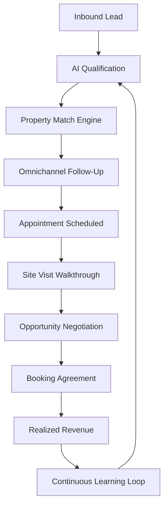

# WefyLabs Real Estate Revenue Intelligence Graph

## 1. Executive Summary & Architectural Thesis
The **Revenue Intelligence Graph** represents the connective tissue of WefyLabs, linking operational real estate entities—leads, identities, conversations, property inventory, recommendations, follow-ups, appointments, site visits, opportunities, bookings, and realized revenue—into an attributable, queryable, directed causal graph.

Rather than introducing an operational overhead with a separate graph database, the Intelligence Graph is implemented natively on PostgreSQL utilizing recursive CTEs, indexed association edges (`sales_outcome_edges`), and JSONB metadata, guaranteeing ACID durability and strict multi-tenant boundary isolation.



## 2. Core Entities in the Intelligence Graph
1. **Organization (`organization_id`)**: Root multi-tenant isolation anchor.
2. **Lead (`lead_id`)**: Prospect identity resolved across phone, email, WhatsApp.
3. **Property (`property_id`)**: Inventory unit, price bracket, specifications, location coordinates.
4. **AI Recommendation (`recommendation_id`)**: Specific property or action suggested by AI runtime.
5. **Human Sales Action**: Agent overrides, message edits, call completions.
6. **Milestone Events**:
   - `LEAD_QUALIFIED`
   - `PROPERTY_MATCH_ACCEPTED`
   - `APPOINTMENT_BOOKED`
   - `SITE_VISIT_COMPLETED`
   - `OPPORTUNITY_ADVANCED`
   - `BOOKING_CREATED`
   - `REVENUE_REALIZED`

## 3. Schema & Storage Representation
Graph transitions are stored in `sales_outcome_edges`:
```sql
CREATE TABLE sales_outcome_edges (
    id VARCHAR(36) PRIMARY KEY,
    organization_id VARCHAR(36) NOT NULL,
    source_entity_type VARCHAR(40) NOT NULL,
    source_entity_id VARCHAR(36) NOT NULL,
    target_entity_type VARCHAR(40) NOT NULL,
    target_entity_id VARCHAR(36) NOT NULL,
    relation_type VARCHAR(60) NOT NULL,
    weight NUMERIC(7,4) DEFAULT 1.0,
    occurred_at TIMESTAMPTZ NOT NULL,
    created_at TIMESTAMPTZ NOT NULL,
    metadata_json JSONB DEFAULT '{}'
);
CREATE INDEX ix_edge_org_source ON sales_outcome_edges (organization_id, source_entity_type, source_entity_id);
CREATE INDEX ix_edge_org_target ON sales_outcome_edges (organization_id, target_entity_type, target_entity_id);
```

## 4. Graph Traversal & Causal Analysis
Every transition answers four critical enterprise inquiries:
1. *What happened after this AI recommendation?* (Follow edges forward to downstream booking or rejection)
2. *What lead scores correlate with completed site visits?* (Aggregate path conversions by lead scoring tier)
3. *Where do opportunities stall?* (Identify edges with highest mean transition latency or zero outgoing edges)
4. *Which agent actions produce the highest conversion velocity?*

## 5. Security & Isolation Invariants
- **Strict Tenant Gating**: `WHERE organization_id = :org_id` is mandatory on every graph query.
- **No Cross-Tenant Traversal**: Edges can never connect nodes belonging to different organizations.
- **Append-Only Monotonicity**: Graph edges are created upon milestone occurrence and never mutated.
