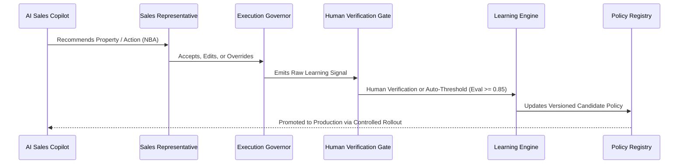

# WefyLabs Continuous Learning Loop Architecture

## 1. Core Operating Philosophy
Master Build 14 enforces the fundamental discipline: **Observe &rarr; Understand &rarr; Measure &rarr; Learn &rarr; Recommend &rarr; Execute Safely &rarr; Measure Outcome &rarr; Improve**.

WefyLabs does **NOT** introduce uncontrolled online weight adjustments or silent customer data retraining. Instead, feedback signals are captured as immutable evidence, subjected to policy verification gates, evaluated offline in versioned candidate sets, and promoted only when passing Build 12 quality and safety thresholds.

## 2. Learning Signal Taxonomy
All signals are strongly typed in `LearningSignalType`:
- `HUMAN_ACCEPT`: Agent executes recommendation without alteration.
- `HUMAN_REJECT`: Agent explicitly dismisses recommendation.
- `HUMAN_EDIT`: Agent modifies message template or property filter before dispatch.
- `HUMAN_OVERRIDE`: Agent manually alters lead qualification or priority score.
- `HUMAN_DISMISS`: Agent silences follow-up notification.
- `HUMAN_SNOOZE`: Agent postpones task with scheduled resumption.
- `HUMAN_IGNORE`: Task reaches SLA timeout without human intervention.
- `CONVERSION_SUCCESS`: Downstream milestone achieved (Site visit completed, booking confirmed).
- `CONVERSION_FAILURE`: Lead churned, appointment no-show, or deal lost.

## 3. Human Override as First-Class Signal
When a human overrides an AI recommendation:
1. `is_human_override` is flagged as `true`.
2. `overrode_ai_recommendation_id` links back to the original AI action record.
3. `override_reason` captures categorical rationale (`PRICE_MISMATCH`, `LOCATION_UNSUITABLE`, `CUSTOMER_TIMELINE_SHIFT`).
4. Overrides directly reduce the recommendation acceptance rate and adjust organizational affinity heuristics.

## 4. Controlled Offline Promotion Pipeline
- **Raw Events**: Ingested in real-time with SHA-256 provenance hashes.
- **Dataset Versioning**: Offline datasets frozen for evaluation.
- **Evaluation Gate**: Minimum quality score &ge; 0.85 (faithfulness, hallucination-free, conversion lift).
- **Rollback Safety**: Immediate revert to previous active registry entry if drift occurs.
