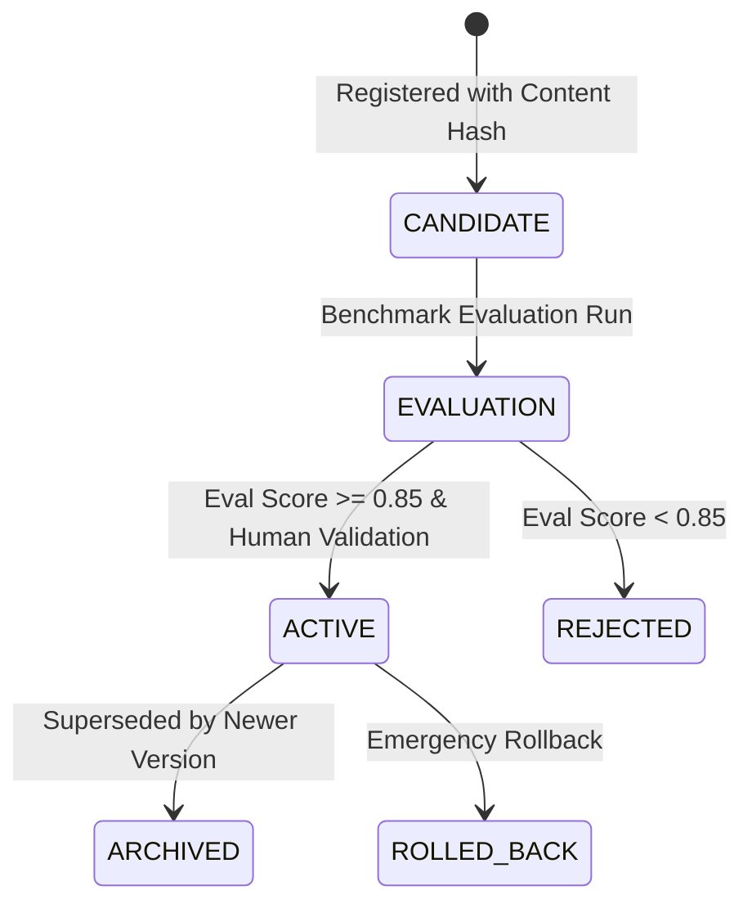

# WefyLabs Policy & Model Registry Architecture

## 1. Scope & Invariants
The Policy & Model Registry governs all versioned entities influencing AI execution and scoring:
- Predictive Lead Qualification Models
- Prompt Templates
- Autonomous Action Policies
- Property Match Ranking Heuristics

**Invariant**: No unversioned change may ever execute in production. Direct database mutations of production policies are mathematically prevented.

## 2. Registry States & Promotion Gates

## 3. Mandatory Promotion Thresholds
To be promoted to `ACTIVE`, a candidate entry must:
1. Possess a deterministic content hash (`content_hash`).
2. Achieve an automated evaluation score $\ge 0.85$ on the standardized validation dataset.
3. Be accompanied by non-empty human validation notes (`validation_notes`).
4. Support immediate zero-downtime rollback to the prior active version.

## 4. Audit Trail
All promotions record `promoted_at`, `promoted_by`, `eval_score`, and `validation_notes`, guaranteeing full regulatory auditability.
