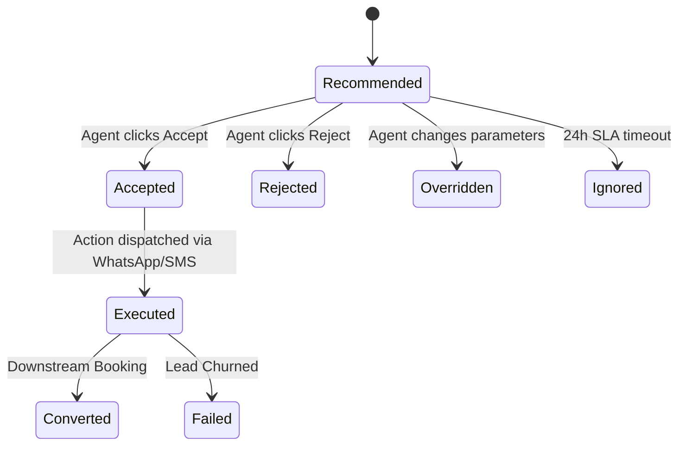

# WefyLabs Recommendation Intelligence & Quality Measurement

## 1. Overview
The Recommendation Intelligence subsystem measures the end-to-end lifecycle and commercial efficacy of all AI suggestions: Property Recommendations, Next-Best-Actions (NBA), and Follow-Up Timings.

## 2. Key Quality Metrics
WefyLabs tracks five primary quality metrics:
1. **Acceptance Rate ($\text{AR}$)**:
   $$\text{AR} = \frac{\text{Accepted Recommendations}}{\text{Total Recommendations}} \times 100$$
2. **Execution Rate ($\text{ER}$)**:
   $$\text{ER} = \frac{\text{Executed Recommendations}}{\text{Accepted Recommendations}} \times 100$$
3. **Success / Conversion Rate ($\text{SR}$)**:
   $$\text{SR} = \frac{\text{Recommendations Leading to Milestone (Site Visit / Booking)}}{\text{Executed Recommendations}} \times 100$$
4. **Override Rate ($\text{OR}$)**:
   $$\text{OR} = \frac{\text{Human Overrides}}{\text{Total Recommendations}} \times 100$$
5. **Rejection Rate ($\text{RR}$)**:
   $$\text{RR} = \frac{\text{Explicit Rejections}}{\text{Total Recommendations}} \times 100$$

## 3. Statistical Validity Thresholds
- **Minimum Sample Size Requirement**: Quality metrics are returned as `NULL` whenever total recommendations in a period are $< 10$.
- **No False Precision**: Acceptance rates are never advertised as statistical facts without sample size disclosures.
- **Tenant Isolation**: Metrics are strictly isolated to the organization. A low acceptance rate in Tenant A cannot skew Tenant B's baseline.

## 4. AI Recommendation Lifecycle Tracking

